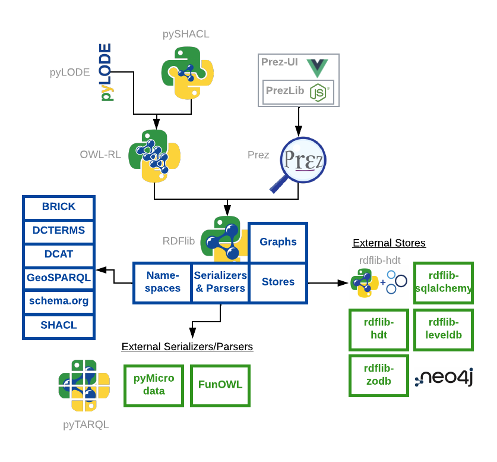

# RDFlib

[RDFLib](https://github.com/RDFLib), is a volunteer-run GitHub organization that maintains is a collection of Python tools for working with RDF data,
principally the [rdflib](https://github.com/RDFLib/rdflib) package.

<!---
## Charter
[//]: #
The RDFLib group operated under a Charter that guides our actions. You can read the Charter here:
[//]: #
* [RDFLib Charter](charter.md)
-->

## rdflib package

The main tool is the [rdflib](https://github.com/RDFLib/rdflib) 
package which contains most of the things you need to work with RDF, including:

* **parsers and serializers*
    * for RDF/XML, N3, NTriples, N-Quads, Turtle, TriX, Trig, JSON-LD and even HexTuples
* **Graph interface**
    * which can be backed by any one of a number of Store implementations
* **Store implementations**
    * for in-memory, persistent on disk (Berkeley DB) and remote SPARQL endpoints
* **SPARQL 1.1 implementation**
    * supporting SPARQL 1.1 Queries & Updates
    * SPARQL function extension mechanisms
* **SPARQL results wrapping**
    * turning SPARQL results from file graphs or SPARQL Endpoints into Python objects
    * formerly a stand-alone package, [SPARQLWrapper](https://github.com/RDFLib/sparqlwrapper/) the main rdflib package now does everything it did

Many 3rd party packages support additional Stores, parsers etc. via a **plugins** interface, e.g. HTD scalable, 
read-only storage. 

## Other RDFLib packages

The other RDFLib repositories are shown in logos or green relating to rdflib's internal modules in blue:

  

* **Core**:
    * [rdflib](https://github.com/RDFLib/rdflib) - the rdflib core

* **Stores**:   
    * RDFLib:  
       * [rdflib-sqlalchemy](https://github.com/RDFLib/rdflib-sqlalchemy) - RDFLib store using SQLAlchemy dbapi as back-end
       * [rdflib-hdt](https://github.com/RDFLib/rdflib-hdt) - A Store back-end for rdflib to allow for reading and querying HDT documents
       * [rdflib-zodb](https://github.com/RDFLib/rdflib-zodb) - RDFLib Store backed by ZODB3
       * [rdflib-leveldb](https://github.com/RDFLib/rdflib-leveldb) - A LevelDB based Store for rdflib 
    * 3rd party:
       * [Neo4J](https://github.com/neo4j-labs/rdflib-neo4j) - using Neo4J as a back-end. Even support RDF-Star

* **Parsers/Serializers**:
   * RDFLib:
     * RDF/XML, JSON-LD, Turtle/N# - built in to rdflib
     * [pymicrodata](https://github.com/RDFLib/pymicrodata) - This a module to extract RDF from an HTML5 page annotated with microdata (archived)
     * [pyrdfa3](https://github.com/RDFLib/pyrdfa3) - RDFa 1.1 distiller/parser library: can extract RDFa 1.1 (and RDFa 1.0, if properly set via a @Version attribute) from (X)HTML, SVG, or XML (archived)
   * 3rd party:
       * [FunOWL](https://github.com/hsolbrig/funowl) - Functional Syntax

* **OWL Reasoning & Documentation**:    
    * [OWL-RL](https://github.com/RDFLib/OWL-RL) - A simple implementation of the OWL2 RL Profile on top of RDFLib
    * [pyLODE](https://github.com/RDFLib/pyLODE) - An OWL ontology documentation tool using Python and templating, based on LODE.

* **SHACL validation**:
    * [pySHACL](https://github.com/RDFLib/pySHACL) - A Python validator for SHACL

* **Linked Data APIs**:
    * [Prez](https://github.com/RDFLib/prez) - A data-configurable Linked Data API framework that delivers profiles of Knowledge Graph data according to the [Content Negotiation by Profile](https://w3c.github.io/dx-connegp/connegp/) standard
    * [Prez-UI](https://github.com/RDFLib/prez-ui) - a [Vue.js](https://vuejs.org/) front-end for Prez

Please see the list of all packages here:

* <https://github.com/RDFLib>

## Documentation

The main source of RDFLib documentation is online at <https://rdflib.readthedocs.io>. That contains pages handwritten 
by RDFLib contributors and also auto-generated pages from the rdflib code.

RDFLib's code repository, <https://github.com/rdflib/rdflib/>, also contains some intro documentation in its README page, 
which is replicated to RDFLib's PyPI page, <https://pypi.org/project/rdflib/>.

RDFLib also contains a set of documented examples in the [`example/`](https://github.com/RDFLib/rdflib/tree/main/examples)
folder within the code repository.

## Releases
7.1.3 is the current release (Jan, 2025) and a major release of a version 8 is expected in the first half of 2025.

some major historical releases of RDFLib are:

| **Release** | **Date**    | **Note**                                                                                  |
|-------------|-------------|-------------------------------------------------------------------------------------------|
| 8.x         | --          | Current `main` branch, unstable release. Due for a major v8 release in July - Spet. 2025  |
| 7.1.4       | 26 Mar 2025 | Minor updates on 7.0.0 including deterministic serialisation, improved type hinting etc.  |
| 7.0.0       | 02 Aug 2023 | A major release with relatively slight breaking changes, new features and bug fixes       |
| 6.0.0       | 20 Jul 2021 | The next major update with lots of auto-update PRs from dependabot etc                    |
| 5.0.0       | 18 Apr 2020 | The first update in many years. Very compatible with 4.2.2                                |
| 4.2.2       | 30 Jan 2017 | A stable release used widely for many years                                               |
| ...         | ...         | ...                                                                                       |
| 1.1.1       | 12 Nov 2002 | First release!                                                                            |

See the [CHANGELOG](https://github.com/RDFLib/rdflib/blob/main/CHANGELOG.md) in the code repository for full details.

## Contributing
RDFLib survives and grows via user contributions! Please consider lodging Pull Requests here:

* <https://github.com/RDFLib/rdflib/pulls>

You can also raise issues here:

* <https://github.com/RDFLib/rdflib/issues>

## Support & Contacts
For general "how do I..." queries, please use https://stackoverflow.com and tag your question with `rdflib`.
Existing questions:

* <https://stackoverflow.com/questions/tagged/rdflib>

If you want to contact the RDFLib maintainers, please do so via:

* the rdflib-dev mailing list: <https://groups.google.com/group/rdflib-dev>
* the chat, which is available at [gitter](https://gitter.im/RDFLib/rdflib) or via matrix [#RDFLib_rdflib:gitter.im](https://matrix.to/#/#RDFLib_rdflib:gitter.im)
